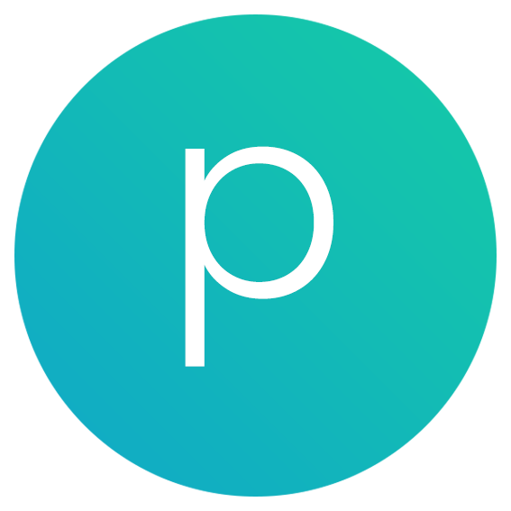
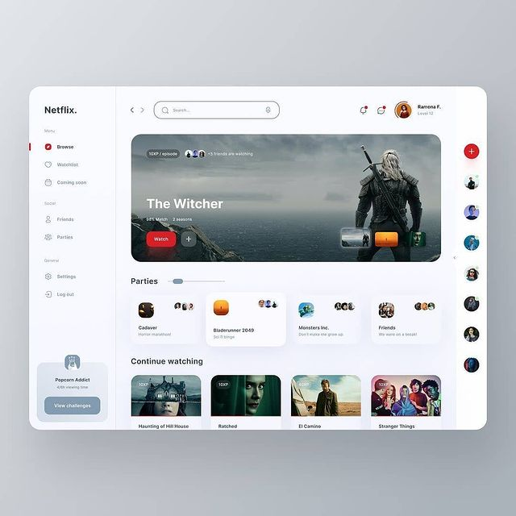

<p id="title" align="center">
  <a href="#title">
    
    <h1 align="center">Dashboard Positive</h1>
  </a>
</p>

<!-- color: 007ec6, 97ca00, 8a2be2 -->
<p align="center">
  <a aria-label="Positive logo" href="https://github.com/aristofanyherderson/">
    
  </a>
  <a aria-label="Project version" href="https://github.com/aristofanyherderson/first-project-with-react/blob/main/package.json">
    
  </a>
  <a aria-label="License" href="https://github.com/vercel/next.js/blob/canary/license.md">
    
  </a>
  <a aria-label="Join me on Linkedin" href="https://github.com/vercel/next.js/discussions">
    
  </a>
</p>

<p align="center">My first project with react</p>

## 🧪 Technologies

This project was developed with the following technologies:

- [React](https://reactjs.org)
- [Next](https://nextjs.org/)
- [TypeScript](https://www.typescriptlang.org/)
- [Sass](https://sass-lang.com/)

Project Dependencies:

- [axios](https://www.npmjs.com/package/axios)
- [sass](https://www.npmjs.com/package/sass)
- [next](https://www.npmjs.com/package/next)
- [react](https://www.npmjs.com/package/react)
- [react-dom](https://www.npmjs.com/package/react-dom)

Dev Dependencies:

- [@types/node](https://www.npmjs.com/package/@types/node)
- [@types/react](https://www.npmjs.com/package/@types/node)
- [eslint](https://www.npmjs.com/package/eslint)
- [eslint-config-next](https://www.npmjs.com/package/eslint-config-next)
- [json-server](https://www.npmjs.com/package/json-server)
- [typescript](https://www.npmjs.com/package/typescript)

## Getting Started

Clone the project and access the project folder

```bash
$ git clone https://github.com/aristofanyherderson/first-project-with-react
$ cd first-project-with-react
```

To run it, follow the steps below:
```bash
# Install dependecies
$ yarn

# Init json-server
$ yarn server

# Run the project
$ yarn start
```

Open http://localhost:3000 with your browser to see the result.

## 💻 Project

The project is perfect for institutions that want to control and show new content to their students in a didactic and modern way! 

This is a project that was developed for the learning and evolution of the developer, being the first practical project, carried out entirely by him.


## Layout

You can view the project layout through the image and link below:

<p id="title" align="center">
  <a href="https://www.instagram.com/p/CN9kGFgA-tO/">
    
    <p align="center">@websitebrainy</p>
  </a>
</p>

## Author
